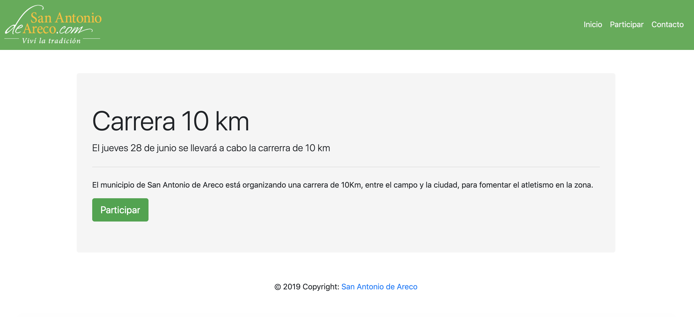
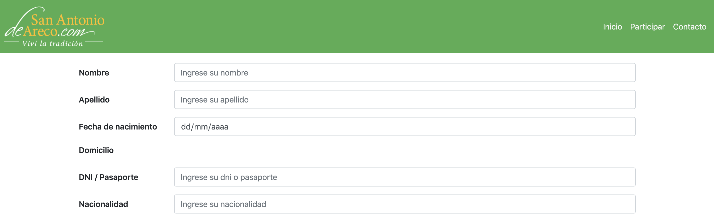
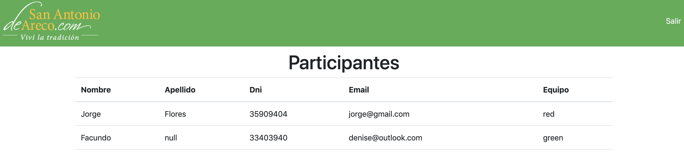

# App Seguridad Informática

Aplicación de prueba para la materia seguridad Informática

## Overview

La aplicación fue desarrollada con Node, Express, Javascript, HTML, CSS.

## Start App

```
$ npm install
```

```
$ npm run start
```

App running in [https://localhost:3000](https://localhost:3000/)

## Security

Se utilizan expresiones regulares para validar los forms tanto en la API como del lado del client. Se escapan tambien problemas de XSS, utilizando regex para evitar scripts entre los inputs, se utilizan queries `prepared stament` para evitar injección de SQL.

## Configuration

- La aplicación necesita tener el servicio de mysql corriendo, ya que se conecta para obtener los datos de los participantes.
- Mock de datos de prueba `database.sql`

## Views App

<div style="text-align:center;margin:auto">
    
</div>

<div style="text-align:center;margin:auto">
    
</div>

<div style="text-align:center;margin:auto">
    
</div>